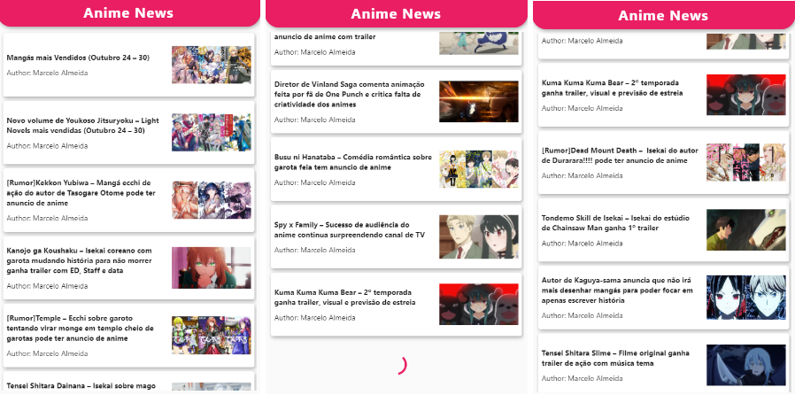

# 📱 AnimeNews - Usando Bloc

O projeto foi um desafio proposto pela Flutterando Masterclass para consumir uma API de notícias de Anime usando o padrão Bloc.

## Desenvolvimento: 
* Dart `null safety`
* Padrão `Bloc`
* Consumo de API 
* Lista infinita 
* Versão Flutter: `3.3.7`

## Resultado Final: 

